# MetroVR

This is a virtual reality video game developped for a software engineering project at [ENSSAT](https://enssat.fr) by the Team Kiwi. This game is made with the [Godot engine](https://godotengine.org) ``v4.3`` and is configured to run on the Meta Quest VR headsets (tested with the Meta Quest 2 and 3). The game uses [Bastiaan Olij](https://github.com/BastiaanOlij)'s [OpenXR Vendors plugin](https://github.com/GodotVR/godot_openxr_vendors/releases) where every basic VR feature has been implemented in GDscript.  
  
Thank you for playing our game on behalf of the whole team, if you want to contact us, feel free to join our [official discord server](https://youtu.be/dQw4w9WgXcQ). Enjoy ;)  

# Content table
- [Installation guide](#installation-guide)
    - [Build your own apk](#build-your-own-apk)
        - [Prerequisites](#prerequisites)
        - [Create the export preset](#create-the-export-preset)
        - [Building on your headset](#building-on-your-headset)
    - [Use an already existing apk](#use-an-already-existing-apk)
- [Programming guide](#programming-guide)
    - [How to create an asset in Blender](#how-to-create-an-asset-in-blender)
    - [How to add an asset](#how-to-add-an-asset)
    - [How to create and use a GridMap](#how-to-create-and-use-a-gridmap)
    - [How to create a pickable object](#how-to-create-a-pickable-object)
    - [How to create a melee weapon](#how-to-create-a-melee-weapon)
    - [How to create a range weapon](#how-to-create-a-range-weapon)
    - [How to create a spell](#how-to-create-a-spell)
    - [How to create an enemy](#how-to-create-an-enemy)
    - [How to create a UI](#how-to-create-a-ui)

# Installation guide

In order to install the project and build the game in yout VR headset, you need the game ``.apk`` file. To doo so, you have the choice between pulling the project and compiling the ``.apk`` file and building it on the VR headset with Godot or if you already have the ``.apk`` file, you can directly build it on the headset with the [Meta Quest Developer Hub](https://developers.meta.com/horizon/documentation/unity/ts-odh/) app.

## Build your own apk

### Prerequisites
- Install [Godot engine ``v4.3``](https://godotengine.org)
- Install [OpenJDK 17](https://www.oracle.com/java/technologies/javase/jdk17-archive-downloads.html)
- Install [Android studio](https://developer.android.com/studio?hl=fr) and make sure to run it once in order to create all the configuration files :  
    - **Windows/MacOs :** simpy launch the Android Studio application
    - **Linux :** run the following commands :
        ```bash
        cd {installation home}/bin
        ./studio.sh
        ```

### Set the SDK paths
After installing the prerequisites, you need to configure the SDK paths in Godot's Editor settings :  
  
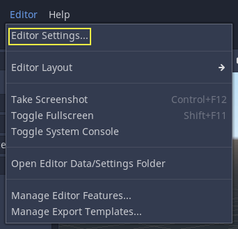  
  
Scroll down to the section where the Android settings are located : 
   
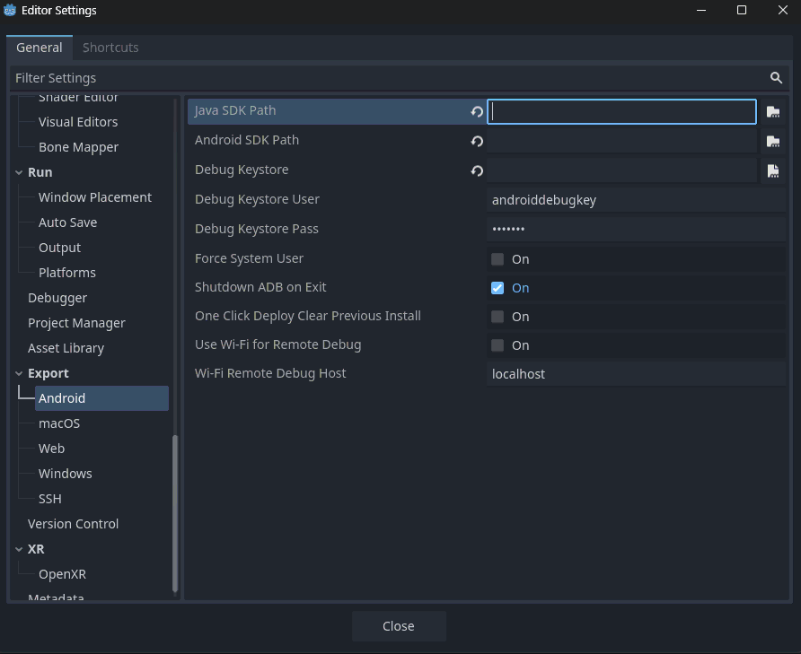
  
Then you will need to set the right SDK paths, if you let the default ones during installation it should be :  
- **Windows :**
    - Java SDK Path : ``C:/Program Files/Eclipse Adoptium/jdk-17.0.13.11-hotspot``
    - Android SDK Path : ``C:/Users/{your_username}/appdata/Local/Android/Sdk ``
- **Linux :**
    - Java SDK Path : ``/usr/lib/jvm/jdk-17.0.12-oracle-x64``
    - Android SDK Path : ``~/Android/Sdk``
- **MacOS :**
    - Java SDK Path : ``/Library/Java/JavaVirtualMachines/jdk-17.jdk/Contents/Home``
    - Android SDK Path : ``/Users/{your_username}/Library/Android/sdk ``

### Create the export preset
To be able to build the project into an apk file, we need to create an android runnable export preset :
  
  
  
After that, the gradle build needs to be enabled :
  

  
Then, OpenXR must be selected as XR Mode in the XR Features menu : 
   

  
Finally the Meta Plugin must be enabled :
  
  

### Building on your headset
Now that the preset has been configured, all you need to do is to build the game on your Meta Quest with the remote debug option :  
  
  
  
**Troubleshooting :** if you are on Linux and you get an error concerning adb, you need to delete the previous version by running the following command :   
```bash
adb uninstall {your_project}
# Example: adb uninstall com.example.metrovr
```


## Use an already existing apk
If you already have an apk file on your computer, you only need to launch the Meta Quest Developer Hub app and to add the build : 
  


# Programming guide

## How to create an asset in Blender

## How to add an asset

## How to create and use a GridMap

## How to create a pickable object

First of all, in order to be able to pick up objects, you need to add the pickup function to the hands nodes. This has already been done in the previous versions so don't worry about this step anymore.  

To create the object you want to be able to pick up, you need to create a new inheritted scene, and chose the base scene in ``addons/godot-xr-tools/objects/pickable.tscn`` :  
  
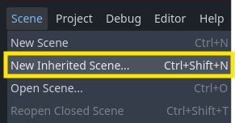   
  
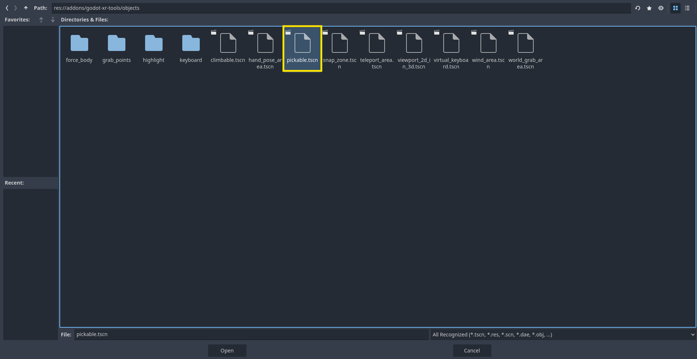   
  
You now have a new scene which is a child of the pickable object scene. However, this new scene does not have a shape, so you need to create a new meshInstance3D and add a shape to the collisionShape3D.  
  
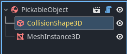  
  
Finally, for a better experience, you can add grabpoints to define the points from where you grab the object. To do so, you first need to instantiate a child scene and choose the ``grab_point_hand`` scene (left or right depending on the hand). The grab point will be created but will not appear in the scene because you need to toggle visibility :  
  
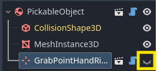  
  
Then, all you need to do is place the grab point wherever you like on the object. For a better experience, you can even change the pose of the hand to match the ocject shape or purpose by choosing a pose in the ``addons/godot-xr-tools/hands/animations`` folder :  
  
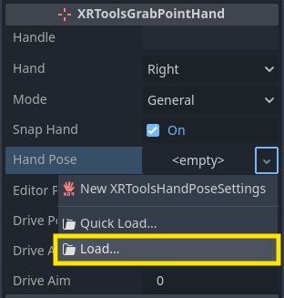    
  
## How to create a melee weapon

## How to create a range weapon

## How to create a spell

## How to create an enemy

## How to create a UI

## How to Create an Interactable Screen with Viewport2Din3D  

First of all, you need to add the special node **`Viewport2Din3D`** (included in the XRTools plugin) wherever you want. It's useful for creating an interactable screen. For example, we wanted our in-game menu to be fixed to our left hand, so we made it a child of the hand node:  

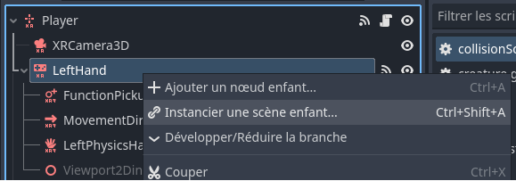  
  

Once created, you need to adjust some parameters to achieve the desired result. In the following image, the main properties to change are highlighted:  

1. **Screen Size**: You can adjust it as you wish, but it's better if it's close to the **Viewport Size** (3) to maintain a consistent resolution.  
2. **Viewport Size**: This defines the resolution of the screen.  
3. **Scaling**: You can create a large screen and reduce its size using the scale property (4) without losing quality.  
4. **Collision Layers**: Pay attention to (5); disable the collision layers you don't want the screen to interact with.  

The **most important property** is (2), as it defines the 2D scene displayed on the screen.  

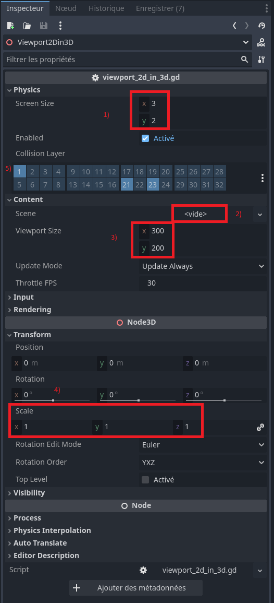  

---

### Designing the Menu  

To create the menu, you need a **Node2D** and a **Control** node. Optionally, you can add a **ColorRect** node to enhance its appearance. Next, add a **MarginContainer** node for your buttons or other UI controls. You can fine-tune its position using anchors if you want your buttons in specific locations.  

Add a **VBoxContainer** (or **HBoxContainer**) to group multiple Control nodes (e.g., buttons, checkboxes, progress bars) for easier alignment and consistent spacing.  

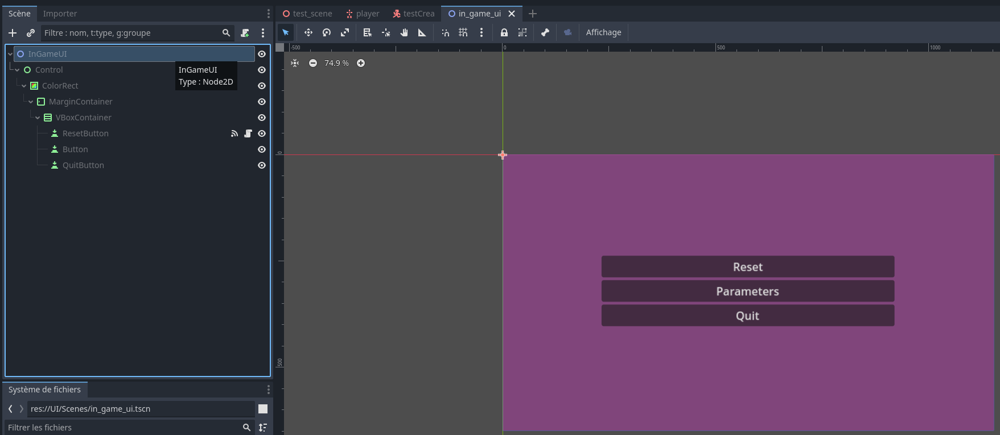  
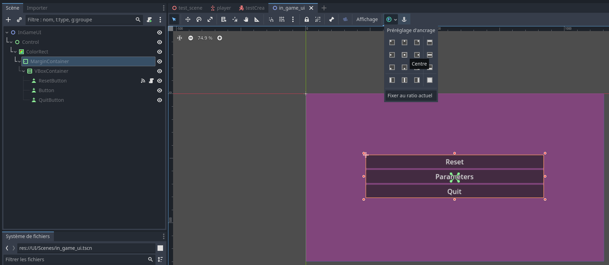  

After finishing the menu and setting your 2D scene in the viewport, it’s recommended to:  

1. **Activate "Unshaded" in Rendering**: This will make your screen glow.  
2. **Disable "Visible" in Visibility**: This hides the screen unless needed.  
3. **Set Process Mode to "When Paused"**: This ensures the screen works only when the game is paused (e.g., for an in-game menu).  

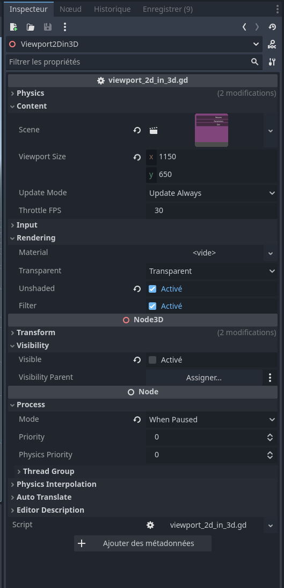  

---

### Adding a Function Pointer  

Finally, you can add a **FunctionPointer** as a child of your hand node. This helps the UI by indicating which button you are about to click. You can also disable the **Visible** property, showing the pointer only when the menu is open (via the following script).  

- **Show Laser Option**: Specifies when the laser is visible (e.g., `Collide` means it appears only when colliding with a UI object like Collision Mask 23 or a Pointable Object like Collision Mask 21).  
- **Laser Length Option**: Determines how the laser is cut (e.g., `Collide` stops the laser when it collides with something).  
- **Collision Masks**: Manage collisions using the appropriate masks.  

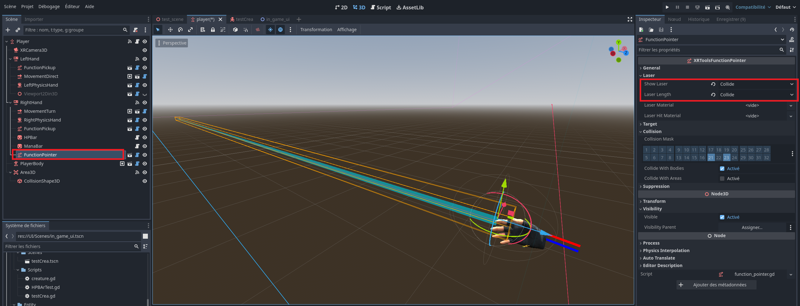  

---

### The Menu Script  

For the script:  

- First, define variables with the `@onready` keyword to initialize them after the game loads.  
- When pressing the **menu button** (see a specific section on how to link a controller button), the game is paused (or resumes if we are closing the menu) with line 23.  
- Lines 24 and 25 make the screen and pointer visible (or invisible if we are closing the menu).  

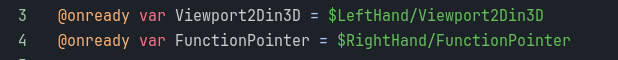  
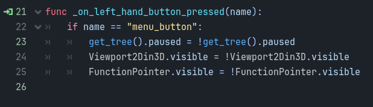  

---

### Button Functionality  

You also need a script for the menu buttons. Here’s an example of a script that sends a signal when a button is clicked:  

- **Reset Button**: When clicked, it reloads the scene (line 16) and resumes the game (line 15). Resuming the game also closes the menu when the scene is reloaded.  

  

