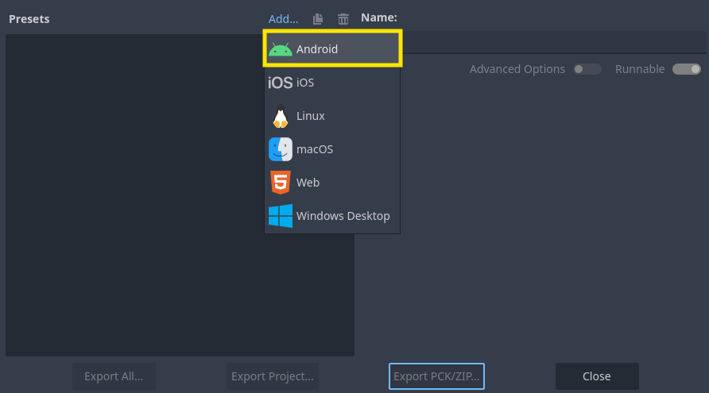
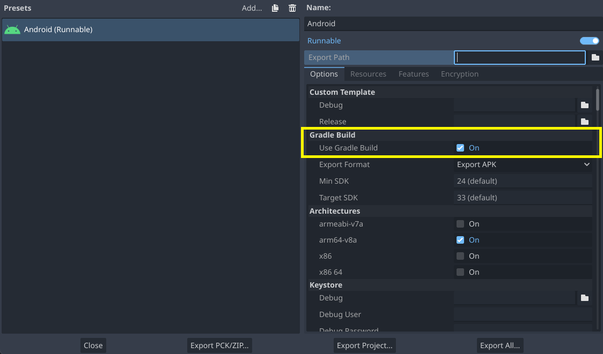
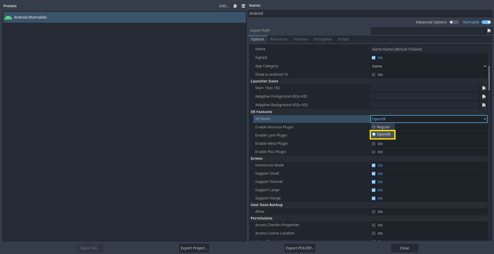
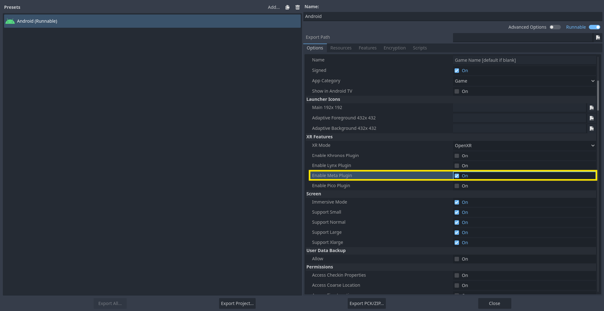
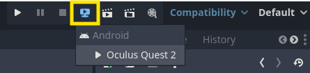
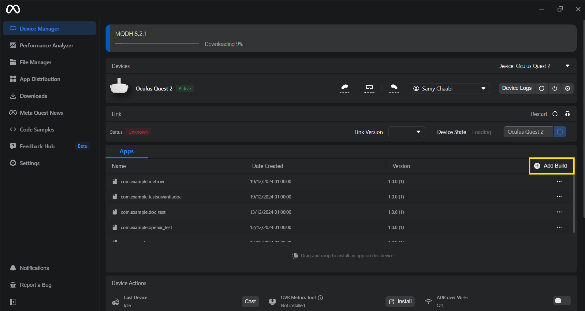

# MetroVR

This is a virtual reality video game developped for a software engineering project at [ENSSAT](https://enssat.fr) by the Team Kiwi. This game is made with the [Godot engine](https://godotengine.org) ``v4.3`` and is configured to run on the Meta Quest VR headsets (tested with the Meta Quest 2 and 3). The game uses [Bastiaan Olij](https://github.com/BastiaanOlij)'s [OpenXR Vendors plugin](https://github.com/GodotVR/godot_openxr_vendors/releases) where every basic VR feature has been implemented in GDscript.  
  
Thank you for playing our game on behalf of the whole team, if you want to contact us, feel free to join our [official discord server](https://youtu.be/dQw4w9WgXcQ). Enjoy ;)  

## Content table
- [Installation guide](#installation-guide)
    - [Build your own apk](#build-your-own-apk)
        - [Prerequisites](#prerequisites)
        - [Create the export preset](#create-the-export-preset)
        - [Building on your headset](#building-on-your-headset)
    - [Use an already existing apk](#use-an-already-existing-apk)
- [Programming guide](#programming-guide)

## Installation guide

In order to install the project and build the game in yout VR headset, you need the game ``.apk`` file. To doo so, you have the choice between pulling the project and compiling the ``.apk`` file and building it on the VR headset with Godot or if you already have the ``.apk`` file, you can directly build it on the headset with the [Meta Quest Developer Hub](https://developers.meta.com/horizon/documentation/unity/ts-odh/) app.

### Build your own apk

#### Prerequisites
- Install [Godot engine ``v4.3``](https://godotengine.org)
- Install [OpenJDK 17](https://www.oracle.com/java/technologies/javase/jdk17-archive-downloads.html)
- Install [Android studio](https://developer.android.com/studio?hl=fr) and make sure to run it once in order to create all the config files

#### Create the export preset
To be able to build the project into an apk file, we need to create an android runnable export preset :
  
After that, the gradle build needs to be enabled :

Then, OpenXR must be selected as XR Mode in the XR Features menu

Finally the Meta Plugin must be enabled :

#### Building on your headset
Now that the preset has been configured, all you need to do is to build the game on your Meta Quest with the remote debug option :  

### Use an already existing apk
If you already have an apk file on your computer, you only need to launch the Meta Quest Developer Hub app and to add the build : 

## Programming guide
